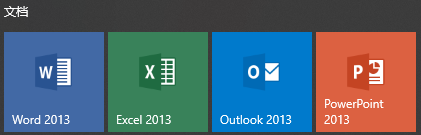
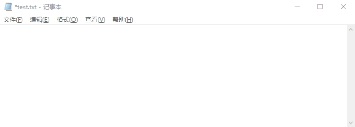

# 项目说明

本程序用于将 markdown 转换为单 html 文件, 并着重解决 **本地图片如何嵌入 html** 的问题.

本程序具有以下特点:

1. 使用简单, 只需传入 .md 文件, 即可一键生成 .html
2. 单文件输出. 无需考虑 markdown 中引用的本地路径的图片, 因为它们已经被嵌入在 html 文件中
3. 便于分享. 您只需要将此 html 文件发送给朋友, 对方即可看到完整的页面内容

# 快速开始

```python
from markdown_images_to_base64 import md_2_html

md_2_html(
   file_i=input('Input a markdown file (*.md, abspath): '),
   file_o=input('Input output path to generated html file (leave it empty if '
                'you want to generate it in the same dir): '),
   #    如果 `file_o` 为空字符串, 它会在 file_i 的同目录下生成同名的 (但不同后缀
   #    的) html 文件. 如果目标文件已存在, 则会覆盖.
)
```

[TODO:AddScreenshots]

--------------------------------------------------------------------------------

以下为详细说明.

# 安装

| 版本 | 说明 | 链接 |
| ---- | ---- | ---- |
| 直装版 (标准版) | 如果您电脑上有安装 [Depsland][0], 请下载此版本 (体积 ???) | [TODO:ToBeUploaded] |
| 直装版 (完整版) | 如果您电脑上没有安装 [Depsland][0], 请下载此版本 (体积 ???) | [TODO:ToBeUploaded] |
| 源代码版 | 克隆本项目到本地 | - |

[0]: https://github.com/likianta/depsland

## 直装版如何安装

1. 下载后得到一个 zip 压缩包
2. 解压它到一个非中文路径下
3. 双击根目录下的 "setup.bat", 完成安装
   1. 标准版在安装过程中可能需要联网, 完整版不需要

[TODO:AddScreenshots]

## 源代码版如何安装

使用 git 命令克隆本项目到本地: 

```
git clone https://github.com/Likianta/markdown-images-to-base64.git
```

**关于依赖选项**

本项目主要包含了两大模块: 转换模块以及 GUI 模块.

如果只使用前者, 请 pip 安装 requirements 文件中列出的依赖:

```
pip install lk-logger
        ... lk-utils
        ... markdown2
```

如果还需要用到后者, 在前者的基础上, 安装以下依赖 (注意体积会很大):

```
pip install enaml
        ... lk-qtquick-scaffold
        ... pyside2
```

值得注意的是, GUI 是基于 enaml 开发的实验性功能, 它存在一些兼容性问题: 您必须使用 Python 3.8 解释器版本. 因为 enaml 在 Python 3.9 版本会报标准库引起的错误 (相关见 [这个讨论](https://docs.python.org/3/whatsnew/3.8.html#cpython-bytecode-changes)).

# 如何使用

## 无 GUI 界面

```
markdown_images_to_base64 (cloned_project)
|= examples
   |= .assets
      |- hello.gif
      |- msoffice.png
   |- demo.md           :: 这是要转换的文件 (以下是原文内容)
      |
      |     Here are local images to test:
      |
      |     
      |
      |     
      |
   |- test_convert.py   : 我们使用这个脚本来测试转换效果
   |- ...
|= markdown_images_to_base64
   |- __init__.py
   |- launch_gui.py
   |- ...
```

```python
# examples/test_convert.py
from markdown_images_to_base64 import md_2_html

md_2_html("./demo.md")
#   params[0]: file_i: str. 要输入的文件的路径, 文件类型必须是 ".md".
#   params[1]: file_o: optional[str]. 输出文件位置.
#       None: 在 file_i 同一目录下生成同名的, 后缀为 ".base64.html" 的文件.
#       str: 自己指定一个要输出的文件的路径.
#           - 后缀必须为 ".html".
#           - 如果目标文件存在, 则会被覆盖.

```

## GUI 界面 (可选)

1. 运行 'markdown_images_to_base64/launch_gui.py', 弹出可视化界面

   

2. 输入或选择 .md 文件, 点击 "Run" 按钮

3. 提示生成成功, 生成文件与 markdown 文件在同一目录, 与 markdown 文件同名 (后者后缀是 ".base64.html" )

   

# 注意事项

1. 目前仅支持对本地图片的获取和编码
2. 当图片较多时, 需要较长的处理时间 (待优化)

# 开发者说明

## 生成文件的体积对比

以演示用例为例, 'examples/demo.html' 大小约 18kb, 该 html 引用了两张图片的大小分别为 19kb 和 33kb.

使用浏览器的 "转换为 mhtml" 功能, 生成的 .mhtml 文件的大小为 90kb; 使用 markdown_images_to_base64 的 `md_2_html` 生成的 'examples/demo.base64.html' 文件的大小为 86kb.


结论:

1. 本程序生成的 base64 编码的 html 体积上比浏览器生成的 .mhtml 略小一些
2. base64 编码的 html 比原 html + 原图片的体积略大, 这是因为 base64 编码的原因 (base64 编码的图片会比原图大 1/3)
