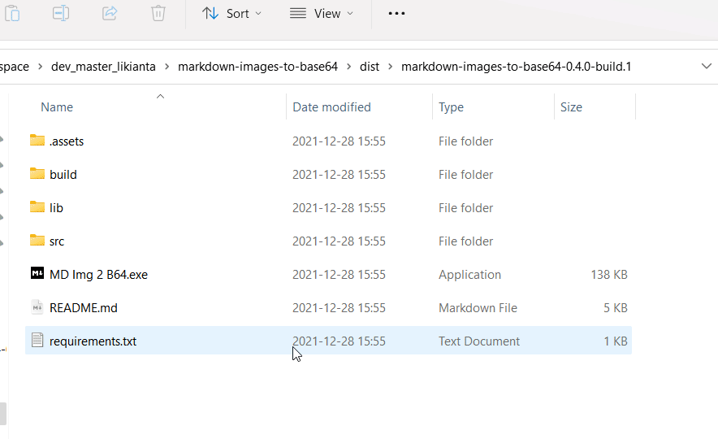
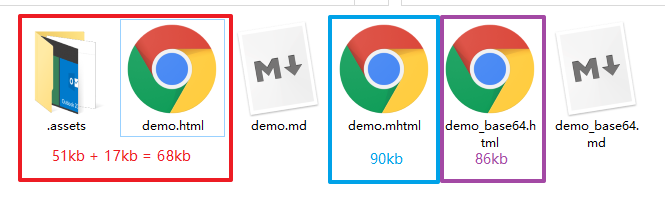

# 项目说明

本程序用于将 markdown 转换为单 html 文件, 并着重解决 **本地图片如何嵌入 html** 的问题.

本程序具有以下特点:

1. 使用简单, 只需传入 .md 文件, 即可一键生成 .html
2. 单文件输出. 无需考虑 markdown 中引用的本地路径的图片, 因为它们已经被嵌入在 html 文件中
3. 便于分享. 您只需要将此 html 文件发送给朋友, 对方即可看到完整的页面内容



# 快速开始

## 通过 GUI 启动

从 Release 页面下载压缩包, 解压后得到 exe 程序, 双击即可启动.

## 通过脚本启动

将本项目克隆到本地, 并新建一个下面的脚本文件来启动:

```python
# 先将 md_img_2_b64 的父目录加入到 sys.path 中.

from md_img_2_b64 import md_2_html

md_2_html(
   file_i=input('Input a markdown file (*.md, abspath): '),
   file_o=input('Input output path to generated html file (leave it empty if '
                'you want to generate it in the same dir): '),
   #    如果 `file_o` 为空字符串, 它会在 file_i 的同目录下生成同名的 (但不同后缀
   #    的) html 文件. 如果目标文件已存在, 则会覆盖.
)
```

# 其他说明

## 关于依赖选项

本项目以及安装程序均没有自带依赖, 您需要自行先安装 python 和相关依赖库.

依赖清单在 "requirements.txt" 文件中给出:

```
fire
lk-logger
lk-utils
markdown2
pysimplegui
```

# 注意事项

1. 目前仅支持对本地图片的获取和编码, 网络图片仍然保持原链接.
2. 当图片较多时, 需要较长的处理时间.
3. 要求 Python 版本为 3.8 及以上.

# 开发者说明

## 生成文件的体积对比

以演示用例为例, 'examples/demo.html' 大小约 18kb, 该 html 引用了两张图片的大小分别为 19kb 和 33kb.

使用浏览器的 "转换为 mhtml" 功能, 生成的 .mhtml 文件的大小为 90kb; 使用 markdown_images_to_base64 的 `md_2_html` 生成的 'examples/demo.base64.html' 文件的大小为 86kb.



结论:

1. 本程序生成的 base64 编码的 html 体积上比浏览器生成的 .mhtml 略小一些
2. base64 编码的 html 比原 html + 原图片的体积略大, 这是因为 base64 编码的原因 (base64 编码的图片会比原图大 1/3)
